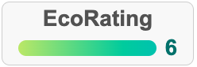

# Biyiud's Widget
## Introduction
The BIyiud's widget is a simple and lightweight solution for displaying a user's BSR (Biyiud Sustainability Rating) score on a client's website. The widget is designed to be easy to integrate and can be customized to fit the client's website's design and layout.

The insertion of the widget is quite simple. Just a 3-line code snippet:
- Load the widget script located at `https://biyiud.eco/widget.js`
- Create a DIV container for the widget
- Call the widget `renderBSRWidget()` function with the container ID and the user ID as arguments.

This is how it looks like:



## Webpage example
This a simple example of a webpage with the Biyiud's widget inserted.
```html
<!DOCTYPE html>
<html lang="en">
<head>
  <meta charset="UTF-8">
  <meta name="viewport" content="width=device-width, initial-scale=1.0">
  <title>Client Website</title>

  <!-- Load the widget script -->
  <script src="https://biyiud.eco/widget.js"></script>
</head>
<body>

  <h1>Welcome to Client's Website</h1>
  <p>This is a basic client website content.</p>

  <!-- Widget container -->
  <div id="bsr-widget"></div>

  <!-- Call the widget rendering function with the user ID -->
  <script>
    // Ensure that the DOM elements are loaded
    document.addEventListener("DOMContentLoaded", function() {
      renderBSRWidget('bsr-widget', 'greener');
    });
  </script>

</body>
</html>
```
